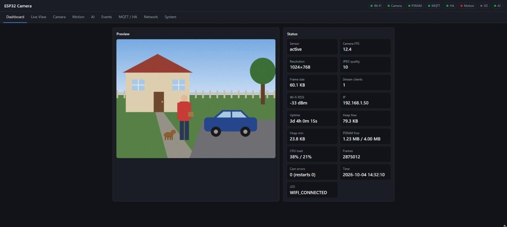
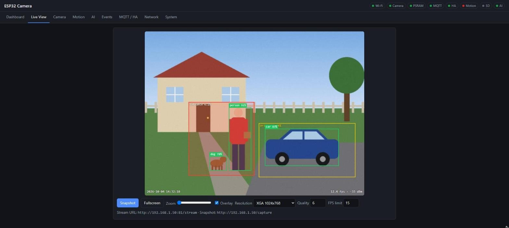
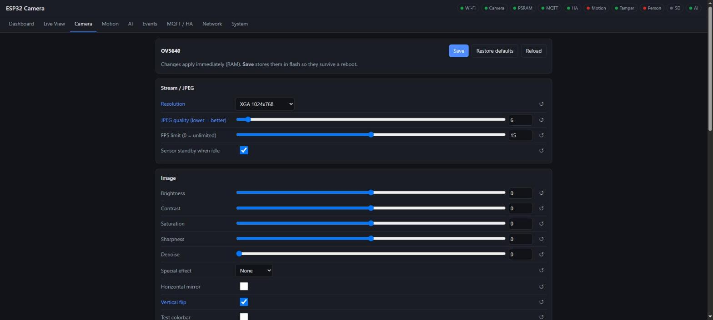
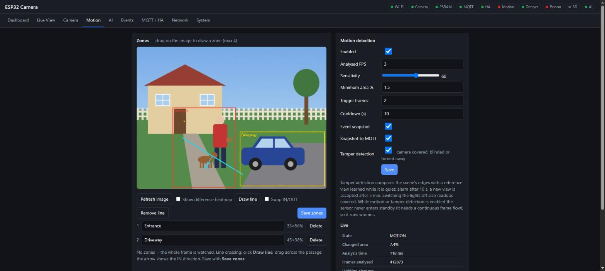
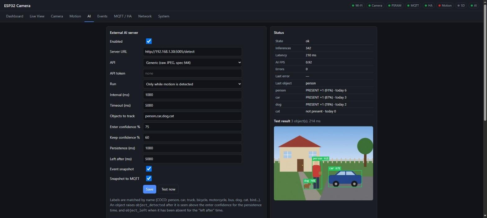
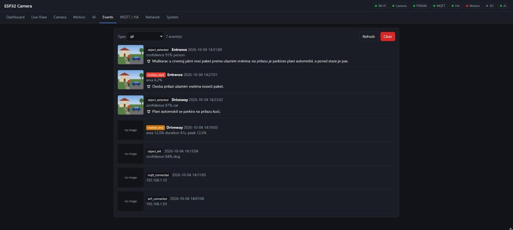
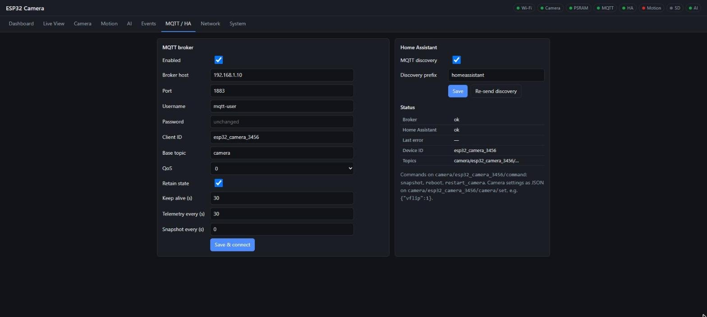
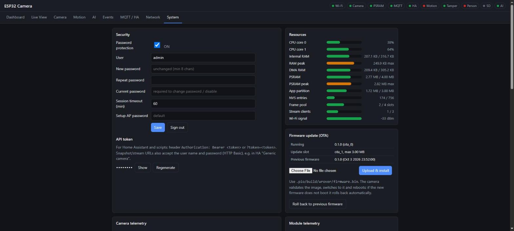
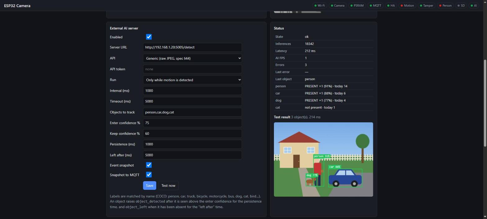
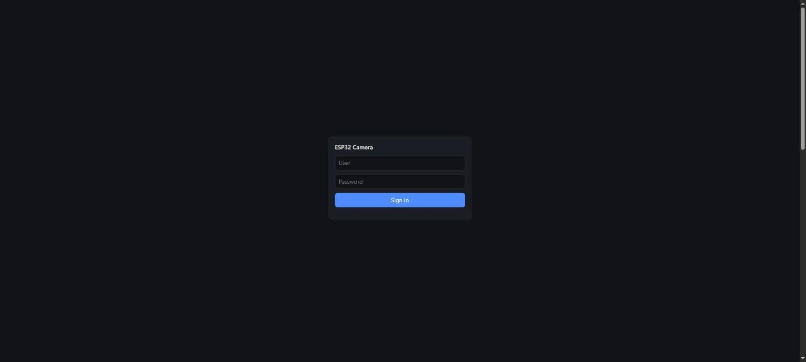

# ESP32-WROVER-DEV v1.6 + OV5640: kamera za Home Assistant

ESP-IDF firmware koji od ESP32-WROVER ploče i OV5640 (5 MP) senzora pravi samostalnu Wi-Fi IP kameru bez cloud-a. Ima web interfejs, REST API, MJPEG stream, WebSocket telemetriju i MQTT/Home Assistant integraciju. Detektuje pokret, sabotažu kamere (prekrivena ili pomerena) i osobe na samom ESP32, broji prelaske linije, a preko eksternog servera prepoznaje objekte i opisuje događaje vision LLM-om.

Detaljan opis modula, tokova podataka i memorije je u **[docs/ARHITEKTURA.md](docs/ARHITEKTURA.md)**.

## Izgled web interfejsa

> Mockup slike: pravi web UI iz firmware-a sa izmišljenim podacima i sintetičkom scenom umesto snimka kamere.

| | |
|---|---|
|  **Dashboard**: pregled sa indikatorima (tamper, pokret, osoba, AI), FPS, Wi-Fi, memorija, CPU, stanje modula |  **Live View**: MJPEG stream, zone pokreta, AI okviri, overlay |
|  **Camera**: sva podešavanja OV5640 senzora |  **Motion**: zone, linija za brojanje, tamper, heatmap razlika, stanje |
|  **AI**: lokalna detekcija osobe i šta model vidi |  **Events**: događaji sa snapshot-ima i AI opisima |
|  **MQTT / HA**: broker i Home Assistant discovery |  **System**: sigurnost, API token, OTA, iskorišćenost resursa, telemetrija |
|  **AI**: eksterni AI server, praćenje objekata, test detekcije |  **Prijava** |

## Hardver

- ESP32-D0WDQ6 (rev 1), 8 MB flash, 4 MB PSRAM, USB-serijski konvertor CH340
- OV5640 na SCCB adresi 0x3C. Pinout je WROVER-KIT/Freenove: XCLK 21, SDA 26, SCL 27, D7..D0 = 35, 34, 39, 36, 19, 18, 5, 4, VSYNC 25, HREF 23, PCLK 22. Pinovi se menjaju u `menuconfig` → *ESP32 Camera board*.
- Status LED na GPIO 2

## Build i flash (PlatformIO)

```sh
pio run                     # build
pio run -t upload           # flash (COM8, podešeno u platformio.ini)
pio device monitor          # serijska konzola, 115200
pio run -t menuconfig       # sdkconfig / pinovi
```

ESP-IDF 5.3.2 se instalira automatski kroz PlatformIO (pioarduino platforma). Komponente `esp32-camera` i `mdns` preuzima IDF component manager.

## Prvo pokretanje

1. Ako Wi-Fi nije podešen, kamera podiže access point **`ESP32-CAM-XXXX`** sa lozinkom **`esp32camera`**.
2. Poveži se na taj AP i otvori **http://192.168.4.1** → *Network* → upiši SSID i lozinku → *Save & connect*.
3. Kada se kamera poveže, dostupna je na **http://esp32-camera-XXXX.local**. Tačna IP adresa piše u serijskom logu i na *Network* tabu. Setup AP se gasi 2 minuta nakon povezivanja.

Wi-Fi se može podesiti i preko serijske konzole: `wifi <ssid> <lozinka>`.

### Inicijalni podaci za prijavu

| | |
|---|---|
| Korisnik | **`admin`** |
| Lozinka | **`espadmin`** |

Zaštita je uključena od prvog pokretanja. Dok je inicijalna lozinka aktivna, web UI prikazuje upozorenje. **Promeni je odmah** na System → Security, jer je javno dokumentovana. Inicijalni podaci se vraćaju posle factory reset-a i serijskom komandom `auth reset`.

## Endpointi

| Metod | Putanja | Opis |
|---|---|---|
| GET | `/` | Web UI |
| GET | `:81/stream` | MJPEG stream (do 3 klijenta) |
| GET | `/capture`, `/api/snapshot` | JPEG snapshot |
| GET | `/api/status` | Status (FPS, heap, PSRAM, CPU, Wi-Fi, kamera) |
| GET/POST | `/api/camera` | Sva podešavanja kamere sa opsezima; POST primenjuje `{"id": vrednost}` u RAM |
| POST | `/api/camera/save` | Snima trenutna podešavanja u NVS |
| POST | `/api/camera/defaults` | Vraća podrazumevane vrednosti (u RAM) |
| POST | `/api/camera/af` | Pokreće autofokus |
| GET/POST | `/api/wifi` | Wi-Fi podešavanja |
| GET | `/api/wifi/scan` | Skeniranje mreža |
| GET/POST | `/api/system` | Informacije o sistemu i lista taskova; POST `{"device_name"}` |
| POST | `/api/time` | `{"epoch": <unix s>}`: postavlja vreme iz browsera ako NTP ne radi |
| POST | `/api/login`, `/api/logout` | Prijava (session cookie) / odjava |
| GET/POST | `/api/security` | Zaštita: lozinka, API token, timeout sesije, lozinka setup AP-a |
| GET/POST | `/api/ota` | Stanje OTA slotova / upload `firmware.bin` (samo uz uključenu zaštitu) |
| POST | `/api/ota/rollback` | Povratak na prethodni firmware |
| POST | `/api/reboot` | Restart |
| POST | `/api/factory-reset` | `{"wifi": true}` briše i Wi-Fi podešavanja |
| GET | `/api/telemetry` | Live registri senzora (ekspozicija, gain, AWB…) i telemetrija modula |
| GET/POST | `/api/mqtt` | MQTT/HA podešavanja |
| POST | `/api/mqtt/discovery` | Ponovo šalje HA discovery |
| GET/POST | `/api/motion` | Podešavanja i stanje detekcije pokreta, zone |
| GET | `/api/motion/debug` | Mreža razlika (heatmap) za podešavanje osetljivosti |
| GET/POST | `/api/ai` | Podešavanja i stanje eksternog AI-ja |
| POST | `/api/ai/test` | Jedna inferencija odmah (objekti + analizirani frame) |
| GET/POST | `/api/llm` | Podešavanja AI opisa (vision LLM) |
| POST | `/api/llm/test` | Opis trenutne slike (rezultat stiže u status) |
| GET/POST | `/api/person` | Lokalna detekcija osobe (na ESP32): podešavanja i stanje |
| POST | `/api/person/test` | Jedna provera odmah (skor + isečak 96×96 koji model vidi) |
| GET | `/api/events` | Dnevnik događaja (`?limit=N`) |
| GET | `/api/events/snapshot?id=N` | Snapshot događaja |
| POST | `/api/events/clear` | Briše događaje |
| GET | `/api/stats` | Statistika po satu za poslednja 24 h |
| POST | `/api/stats/reset` | Briše statistiku |
| WS | `/ws` | Status svake sekunde i događaji u realnom vremenu |

## Sigurnost

Zaštita je uključena od prvog pokretanja, sa inicijalnim podacima `admin` / `espadmin` (vidi gore). Korisnik i lozinka se menjaju na **System → Security**. Zaštićeno je sve: `/api/*`, `/capture`, stream na portu 81 i WebSocket.
- **Web UI:** prijava sa sesijom. Cookie je HttpOnly i SameSite=Strict, a sesija ističe posle zadatog vremena neaktivnosti.
- **Home Assistant i skripte:** API token (`Authorization: Bearer <token>` ili `?token=<token>`), ili HTTP Basic sa korisnikom i lozinkom, npr. u HA „Generic camera“.
- **Lozinka** se čuva kao PBKDF2-SHA256 sa salt-om. Posle 5 pogrešnih pokušaja prijava se privremeno zaključava.
- **OTA** (System → Firmware update) radi samo kad je zaštita uključena. Ako novi firmware ne može da se pokrene, kamera se automatski vraća na prethodni.
- **Zaboravljena lozinka** (potreban je fizički pristup, USB):
  - serijska komanda `auth reset` vraća `admin` / `espadmin` sa uključenom zaštitom;
  - `auth off` privremeno isključuje zaštitu, a lozinka ostaje sačuvana;
  - `auth token` ispisuje API token.
- Lozinka setup AP-a se menja u istoj kartici.

## MQTT / Home Assistant

Podešava se na tabu **MQTT / HA**. Topici imaju oblik `camera/<device>/…`, gde je `<device>` hostname sa `_` umesto `-`, npr. `esp32_camera_0064`:

| Topic | Sadržaj |
|---|---|
| `availability` | `online` / `offline` (retained, Last Will) |
| `telemetry` | JSON: rssi, fps, heap, psram, uptime, cpu, camera_ok, URL-ovi (retained, period podesiv) |
| `snapshot` | JPEG slika za HA MQTT camera entitet (retained) |
| `event` | JSON događaji (pokret, tamper, osoba, AI objekti, linija, OTA…) |
| `command` | `snapshot`, `reboot`, `restart_camera` |
| `motion`, `motion/zoneN` | `ON` / `OFF` (retained) |
| `motion/set` | `ON` / `OFF`: uključuje ili isključuje detekciju pokreta |
| `person`, `car`, … | JSON po praćenoj klasi: `{"detected":true,"confidence":0.92,"x","y","width","height","zone","timestamp"}` (retained) |
| `person_local` | JSON lokalne detekcije osobe `{"detected","confidence","zone","timestamp"}` (retained) |
| `person_local/set` | `ON` / `OFF`: uključuje ili isključuje lokalnu detekciju osobe |
| `line` | JSON brojača prelaska linije `{"in","out","last"}` (retained) |
| `tamper` | JSON `{"state":"ON"/"OFF","reason":"covered"/"dark"/"moved"}` (retained) |
| `description` | JSON poslednjeg događaja sa AI opisom (retained) |
| `ai/set` | `ON` / `OFF`: uključuje ili isključuje AI; komande `ai_on` / `ai_off` na `command` |
| `camera/set` | JSON podešavanja kamere, npr. `{"vflip":1,"quality":10}` |

Kad je discovery uključen, HA automatski dobija uređaj sa kamerom (snapshot), dijagnostičkim senzorima i dugmadima. Ponovo ga šalje kad se HA restartuje (`homeassistant/status`).

## Detekcija pokreta

Tab **Motion**: zone se crtaju prevlačenjem preko slike. Heatmap prikazuje šta senzor vidi kao promenu.
- *Sensitivity*: koliko se pojedinačna ćelija mora promeniti.
- *Minimum area*: koji deo zone se mora promeniti.
- *Trigger frames*: koliko frame-ova zaredom.
- *Cooldown*: koliko mirnih sekundi pre nego što pokret završi.

Nagla promena većine slike, npr. kad se upali svetlo, ne pokreće alarm. Dok je detekcija uključena, senzor ne ide u standby.

Dekodiranje JPEG-a za analizu traje 200–350 ms (XGA), pa analiza ne zauzima više od oko polovine jezgra: ako traženi *Analysed FPS* ne može da se postigne, stvarni FPS se smanji (vidi se na Motion tabu kao *Analysis time*).

## Lokalna detekcija osobe (na samom ESP32)

Radi bez servera i bez interneta: TensorFlow Lite Micro model „person detection“ (Apache-2.0, 96×96, ~300 KB) izvršava se na ESP32.
- **Rezultat:** samo „osoba / nije osoba“ sa verovatnoćom, bez okvira i bez drugih klasa.
- **Brzina:** oko 0,7 s po proveri.
- **Kada radi:** dok traje pokret (podrazumevano) ili stalno. Model gleda kvadrat isečen oko mesta pokreta, pa prepoznaje i udaljenije osobe.
- **Događaji:** posle *confirm* uzastopnih pogodaka iznad praga stiže `person_detected_local` (sa snapshot-om i zonom), a posle *left after* sekundi bez pogotka `person_left_local`.
- **HA:** binary senzor „Person (local)“ i prekidač „Person detection (local)“.

## Prelazak linije

Na Motion tabu: **Draw line**, pa prevuci liniju preko prolaza. Strelica pokazuje smer **IN** („Swap IN/OUT“ ga okreće). Snima se sa **Save zones**.
- Kamera prati težište pokreta i broji prelaske, uz histerezu oko linije.
- Događaji `line_in` / `line_out`; HA senzori „Line in today“ / „Line out today“.
- Linija i brojači se vide i na Live View-u.
- Radi dok je detekcija pokreta uključena. Najpouzdanije je kad kroz prolaz ide jedna osoba odjednom.

## Sabotaža kamere (tamper)

Uključuje se na Motion tabu (*Tamper detection*, podrazumevano isključeno). Radi i kad je detekcija pokreta isključena.
- Kamera pamti mapu ivica scene kao referencu i osvežava je dok je scena mirna (bez pokreta i bez sumnje najmanje 30 s).
- **Prekrivena** (`covered`): energija ivica padne ispod 25 % reference, ili nestane većina ivica uz pad energije ispod 50 %. Ako je slika i tamna, razlog je `dark`.
- **Pomerena** (`moved`): nestane više od 60 % referentnih ivica, a energija ostane.
- Alarm (`tamper`, sa snapshot-om) stiže kad stanje traje 10 s. Prestaje (`tamper_cleared`) 3 s posle povratka slike, a posle 5 min alarma kamera prihvata novi pogled kao referencu.
- **HA:** binary senzor „Tamper“ (device_class `tamper`), razlog je u atributima.
- Gašenje svetla u prostoriji se takođe vidi kao `dark`.

## AI detekcija objekata

Klasični ESP32 je preslab za ozbiljnu lokalnu detekciju objekata (spec §42). Zato kamera šalje frame-ove na AI server u mreži, a server vraća detektovane objekte.
- **Režimi:** samo dok traje pokret (podrazumevano) ili stalno, na zadati interval.
- **Podržani serveri:**
  - priloženi `tools/ai_server` (YOLO): `pip install -r tools/ai_server/requirements.txt`, zatim `python tools/ai_server/server.py`, a u kameri URL `http://<host>:5005/detect`;
  - CodeProject.AI / DeepStack: URL `http://<host>:32168/v1/vision/detection`, API „DeepStack“.
- **Praćenje:** objekat se prijavljuje kao `object_detected` tek kad je viđen iznad *enter* praga tokom *persistence* vremena. Ostaje prisutan dok je iznad *keep* praga, a `object_left` stiže posle *left after* vremena bez detekcije (spec §60).

## AI opis događaja (Ollama / Open WebUI)

Kamera može da pošalje snapshot događaja (pokret ili AI objekat) vision modelu i da opis u jednoj rečenici priloži događaju. Opis se vidi u Events tabu, na MQTT-u `…/description` i u HA senzoru „Last description“, pa se može koristiti u obaveštenjima.
- **Ollama:** URL `http://<host>:11434/api/chat`, a model mora biti vision, npr. `qwen2.5vl:3b`, `gemma3:4b` ili `llava`.
- **Open WebUI / OpenAI API:** URL `http://<host>:3000/api/chat/completions` (ili Ollama `/v1/chat/completions`) i API ključ.

Šalje se samo jedna slika po događaju, uz cooldown, pa i spori CPU modeli rade.

## Statistika

Tab **Stats** prikazuje poslednja 24 sata, po satu:
- **Zbirovi:** događaji pokreta, osobe (lokalno), AI objekti, prelasci linije IN/OUT, tamper alarmi.
- **Brojanje objekata** (spec §35): koliko ih je sada, danas i u poslednja 24 h, po klasi.
- **Detekcije po satu:** stubičasti grafikoni (AI objekti naslagani po klasi, prve četiri klase posebno, ostale kao „other“).
- **Zdravlje po satu:** FPS kamere, AI FPS, Wi-Fi RSSI, opterećenje CPU-a, najmanje slobodnog heap-a i PSRAM-a (uzorak na 10 s).
- Prelaz mišem preko grafikona prikazuje vrednosti sata; *Show table* daje iste podatke kao tabelu.

Statistika se čuva samo u RAM-u, jer brisanje flash-a dok kamera radi zaglavi ovu ploču. Posle restarta počinje od nule. Dok sat nije podešen, sati se broje od uključenja, a kad se vreme dobije (NTP ili browser), podaci se prebacuju na prave sate.

## Kamera, grejanje i standby

- OV5640 se primetno greje kad neprekidno snima. Hladnjak na modulu je preporučen.
- Kad niko ne gleda stream ni ne traži slike, senzor posle 10 s prelazi u **standby** (softverski power-down). Pri sledećem zahtevu se budi za ~0,5 s. Ovo se isključuje opcijom *Sensor standby when idle* na Camera tabu.
- **Detekcija pokreta i sabotaže drže senzor stalno budnim**, jer im trebaju frame-ovi. Isto važi za lokalnu detekciju osobe i prelazak linije, koji rade na osnovu pokreta.
- Podrazumevani *Gain ceiling* za OV5640 je 200 (~12,5x). Veća vrednost daje svetliju sliku pri slabom svetlu, ali i više šuma.

## Serijska konzola

USB (CH340), 115200 baud, npr. `pio device monitor`. Prompt je `cam>`.

| Komanda | Opis |
|---|---|
| `help` | Spisak komandi |
| `wifi <ssid> [lozinka] [hostname]` | Podešava Wi-Fi i povezuje se |
| `status` | Kompletan status u JSON-u |
| `cam` / `cam <podešavanje> <vrednost>` / `cam save` | Stanje kamere, promena podešavanja (u RAM), snimanje u flash |
| `ntp` | Vreme, dostupnost NTP servera, DNS i ručni NTP test |
| `auth reset` | Vraća inicijalne podatke `admin` / `espadmin`, zaštita uključena |
| `auth off` | Privremeno isključuje zaštitu (lozinka ostaje) |
| `auth token` | Ispisuje API token |
| `log <none\|error\|warn\|info\|debug\|verbose> [tag]` | Nivo logovanja |
| `reboot` | Restart |
| `factory_reset` / `factory_reset all` | Briše podešavanja (Wi-Fi ostaje) / sve, uključujući Wi-Fi |

## Statusni LED (GPIO 2)

| Šablon | Stanje |
|---|---|
| Brzo treptanje | Pokretanje |
| 0,5 s uključen / 0,5 s isključen | Povezivanje na Wi-Fi |
| Dvostruki blic | Setup access point je aktivan |
| Kratak blic na 2 s | Povezan na Wi-Fi |
| Trostruki blic | Greška (npr. kamera se nije pokrenula) |
| Ravnomerno treptanje | OTA ažuriranje |
| **Stalno upaljen** | **Neko gleda stream** (indikator privatnosti, spec §29) |

## Home Assistant: primeri

Uređaj se pojavljuje automatski preko MQTT discovery-ja. Primeri ispod koriste podrazumevano ime uređaja „ESP32 Camera“, pa u HA proveri tačne `entity_id` vrednosti.

**Obaveštenje na telefon sa AI opisom i slikom:**

```yaml
automation:
  - alias: "Kamera: obaveštenje sa AI opisom"
    trigger:
      - platform: state
        entity_id: sensor.esp32_camera_last_description
    condition: "{{ trigger.to_state.state not in ['unknown', 'unavailable', ''] }}"
    action:
      - service: notify.mobile_app_telefon
        data:
          title: "ESP32 kamera"
          message: "{{ trigger.to_state.state }}"
          data:
            image: /api/camera_proxy/camera.esp32_camera_snapshot
```

**Osoba ispred kamere noću → svetlo:**

```yaml
automation:
  - alias: "Kamera: osoba noću"
    trigger:
      - platform: state
        entity_id: binary_sensor.esp32_camera_person_local
        to: "on"
    condition:
      - condition: sun
        after: sunset
    action:
      - service: light.turn_on
        target:
          entity_id: light.dvoriste
```

**Uživo slika u HA (Generic Camera):** *Settings → Devices & services → Add integration → Generic Camera*
- Still image URL: `http://<ip-kamere>/capture`
- Stream source: `http://<ip-kamere>:81/stream`
- Authentication: `basic`, sa korisnikom i lozinkom kamere. Umesto toga može i `?token=<API token>` na kraju URL-ova.

## Poznata ograničenja i rešeni problemi

- **Upis u flash dok kamera radi zaglavi ESP32 rev1 + PSRAM.** Interrupt watchdog resetuje čip, bez core dump-a. Firmware zato zaustavlja kameru tokom OTA upisa i potvrde novog firmware-a.
- **NTP:** ako ruter ili firewall blokira NTP za kameru, vreme se uzima iz browsera pri otvaranju web UI-ja (status pokazuje izvor: `ntp` ili `browser`).
- **Lokalna detekcija osobe** daje samo „osoba da/ne“. Za više klasa i okvire koristi se eksterni AI server.
- **Prelazak linije** prati jedno težište pokreta, pa je najpouzdaniji kad kroz prolaz ide jedna osoba odjednom.
- **Nisu urađeni:** HTTPS za web UI i MQTT preko TLS-a (kamera je predviđena za lokalnu mrežu).
- **Ploča nema SD slot.** Pinovi koje WROVER-KIT koristi za SD zauzeti su kamerom (GPIO 4), pa microSD traži SPI na slobodnim pinovima.

## Struktura repozitorijuma

```text
main/                 firmware (ESP-IDF komponenta)
  web/index.html      web UI (ugrađen u firmware)
  models/             TFLite model za detekciju osobe (Apache-2.0)
  Kconfig.projbuild   pinovi kamere, LED, lozinka setup AP-a (menuconfig)
tools/ai_server/      referentni YOLO server za eksterni AI
tools/ui_mock/        lažni backend za snimke web UI-ja (docs/screenshots)
docs/                 arhitektura i slike interfejsa
partitions.csv        raspored flash-a (2 × 3 MB OTA, coredump, storage)
sdkconfig.defaults    ESP-IDF podešavanja
platformio.ini        PlatformIO projekat (COM port, ploča)
```

## Status razvoja

- [x] **Faza 1, kamera:** OV5640 init, PSRAM, JPEG, snapshot, MJPEG stream, watchdog kamere, standby senzora
- [x] **Faza 2, web UI:** Dashboard, Live View, Camera, Network, System, telemetrija senzora i modula
- [x] **Faza 3, MQTT + Home Assistant:** discovery, telemetrija, komande, Last Will
- [x] **Faza 4, detekcija pokreta:** kompenzacija osvetljenja, do 4 zone, event engine sa snapshot-ima
- [x] **Faza 5, lokalni AI:** detekcija osobe na ESP32 (TFLite Micro), prelazak linije sa brojanjem IN/OUT
- [x] **Faza 7, eksterni AI:** generički ili DeepStack/CodeProject.AI server, praćenje objekata, okviri na Live View-u
- [x] **AI opis događaja** preko vision LLM-a (Ollama / Open WebUI)
- [x] **Faza 8, sigurnost:** prijava, API token, HTTP Basic, zaključavanje, zaštićeni OTA sa rollback-om
- [x] **Tamper alarm:** kamera prekrivena, zaslepljena ili pomerena (događaji, MQTT, HA senzor)
- [x] **Statistika:** po satu za 24 h (pokreti, osobe, objekti, IN/OUT, tamper, FPS, RSSI, CPU, memorija), Stats tab sa grafikonima
- [x] **Resursi:** trake iskorišćenosti (CPU, RAM, PSRAM, DMA, particija, NVS, stream slotovi, Wi-Fi) na System tabu

**Sledeće:**
- [ ] Faza 6: microSD preko SPI-ja (podrazumevano isključen), timelapse

## Licence

- Model za detekciju osobe (`main/models/`) je iz TensorFlow Lite Micro primera, pod licencom **Apache-2.0**.
- Komponente `esp32-camera`, `esp-tflite-micro`, `esp-nn`, `esp_jpeg` i `mdns` preuzima ESP-IDF component manager, svaku pod njenom licencom.
